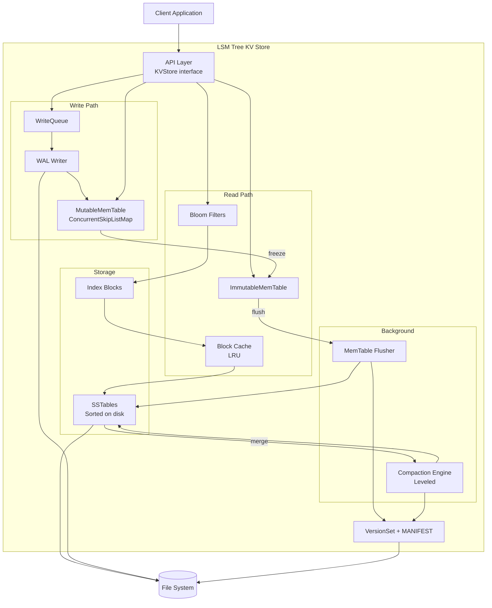

# LSM Tree Key-Value Store

[](https://github.com/adityakrmaurya/LSM-Tree-KV-Store/actions/workflows/ci.yml)
[](https://github.com/adityakrmaurya/LSM-Tree-KV-Store/actions/workflows/codeql.yml)
[](#code-coverage)
[](https://openjdk.org/projects/jdk/21/)
[](https://opensource.org/licenses/Apache-2.0)
[](https://google.github.io/styleguide/javaguide.html)

A production-grade **Log-Structured Merge Tree** key-value store written in Java 21, inspired by [LevelDB](https://github.com/google/leveldb) and [RocksDB](https://github.com/facebook/rocksdb).

## Features

- **Ordered key-value storage** — keys stored in sorted (lexicographic) order
- **Point lookups** — `get(key)` with Bloom filter optimization
- **Range scans** — `scan(startKey, endKey)` via merge iterators
- **Atomic writes** — `WriteBatch` groups multiple mutations
- **Crash recovery** — Write-Ahead Log (WAL) ensures durability
- **Background compaction** — Leveled compaction maintains read performance
- **Concurrent access** — Lock-free reads, serialized writes
- **Modern Java** — Records, sealed interfaces, pattern matching, virtual threads (Java 21)

## Architecture



### Data Flow

| Operation | Path |
|-----------|------|
| **Write** | Client → WriteQueue → WAL append → MemTable insert → ack |
| **Read** | Client → MemTable → ImmMemTable → L0 SSTables → L1..Ln SSTables |
| **Flush** | MemTable full → freeze → background flush → new L0 SSTable |
| **Compaction** | Level trigger → pick files → merge → write output → update VersionSet |
| **Recovery** | MANIFEST → reconstruct VersionSet → replay WAL → ready |

## Quick Start

### Prerequisites

- **Java 21+** (LTS) — [Download](https://adoptium.net/)
- **Gradle 8.12+** (included via wrapper)

### Build

```bash
# Clone the repository
git clone https://github.com/adityakrmaurya/LSM-Tree-KV-Store.git
cd LSM-Tree-KV-Store

# Build (compile + test + style checks)
./gradlew build

# Run tests only
./gradlew test

# Check code format
./gradlew spotlessCheck

# Auto-format code
./gradlew spotlessApply
```

### Usage Example

```java
import com.lsmtreestore.api.KVStore;
import com.lsmtreestore.config.DBConfig;

// Open a database
try (KVStore store = KVStore.open(Path.of("/tmp/mydb"), DBConfig.defaultConfig())) {

    // Write
    store.put("user:1001".getBytes(), "Alice".getBytes());
    store.put("user:1002".getBytes(), "Bob".getBytes());

    // Read
    Optional<byte[]> value = store.get("user:1001".getBytes());
    // value = Optional[Alice]

    // Delete
    store.delete("user:1002".getBytes());

    // Range scan
    try (DBIterator iter = store.scan("user:".getBytes(), "user:~".getBytes())) {
        while (iter.hasNext()) {
            Entry entry = iter.next();
            // process entry.key(), entry.value()
        }
    }
}
```

## Configuration

All parameters are configurable via `DBConfig`:

| Parameter | Default | Description |
|-----------|---------|-------------|
| `maxMemTableSize` | 4 MB | Flush MemTable when it exceeds this size |
| `l0CompactionTrigger` | 4 files | Trigger L0→L1 compaction |
| `l1MaxBytes` | 10 MB | Maximum total size for Level 1 |
| `levelSizeMultiplier` | 10 | Each level is Nx the previous |
| `blockSize` | 4 KB | Target SSTable data block size |
| `bloomFilterBitsPerKey` | 10 | Bloom filter bits per key (~1% FPR) |
| `blockCacheSize` | 8 MB | LRU block cache capacity |
| `syncWrites` | false | fsync per write (true) or group commit (false) |

See [`DBConfig`](src/main/java/com/lsmtreestore/config/DBConfig.java) for the full list.

## Design Decisions

Key architectural choices are documented as Architecture Decision Records (ADRs):

| ADR | Decision | Summary |
|-----|----------|---------|
| [0001](docs/adr/0001-use-skip-list-for-memtable.md) | Skip List MemTable | `ConcurrentSkipListMap` — lock-free reads, proven by LevelDB/RocksDB |
| [0002](docs/adr/0002-leveled-compaction-strategy.md) | Leveled Compaction | Bounded space amplification (~1.1x), better read performance |
| [0003](docs/adr/0003-sstable-file-format.md) | SSTable Format | LevelDB-inspired: data blocks, index, Bloom filter, footer |
| [0004](docs/adr/0004-write-ahead-log-design.md) | WAL Design | CRC32 checksums, 32KB blocks, group commit |
| [0005](docs/adr/0005-concurrency-model.md) | Concurrency Model | Single writer, lock-free readers, virtual threads |
| [0006](docs/adr/0006-bloom-filter-for-reads.md) | Bloom Filters | 10 bits/key, ~1% FPR, per-SSTable |
| [0007](docs/adr/0007-block-cache-design.md) | Block Cache | Shared LRU, 8MB default, data blocks only |
| [0008](docs/adr/0008-java-21-features.md) | Java 21 Features | Records, sealed interfaces, virtual threads |

## Architecture Documentation

Detailed C4 architecture diagrams:

- [Level 1: System Context](docs/architecture/c4-context.md) — the KV Store and its external actors
- [Level 2: Containers](docs/architecture/c4-container.md) — major subsystems within the store
- [Level 3: Components](docs/architecture/c4-component.md) — all internal components and interactions
- [Level 4: Code](docs/architecture/c4-code.md) — class-level diagrams for key subsystems

## Project Structure

```
src/main/java/com/lsmtreestore/
├── api/          # Public KVStore interface
├── common/       # Byte utilities, exceptions
├── config/       # DBConfig
├── wal/          # Write-Ahead Log
├── memtable/     # MemTable (skip list)
├── sstable/      # SSTable reader/writer, blocks, Bloom filter, cache
├── compaction/   # Leveled compaction engine
├── version/      # Version management, MANIFEST
├── iterator/     # Merge iterators for scans and compaction
└── engine/       # Core DB engine, recovery
```

## Contributing

### Code Style

This project follows [Google Java Style](https://google.github.io/styleguide/javaguide.html),
enforced by Spotless and Checkstyle. Before committing:

```bash
./gradlew spotlessApply   # Auto-format
./gradlew build           # Full build with all checks
```

### Testing

- **JUnit 5** with **AssertJ** assertions
- Test naming convention: `methodName_condition_expectedResult`
- Use `@TempDir` for file-based tests
- Target: 90%+ line coverage for core packages

### Pull Requests

- Each PR should address a single concern
- All tests must pass (`./gradlew build`)
- Code must pass format and style checks
- New public APIs must include Javadoc

## License

[Apache License 2.0](LICENSE)
