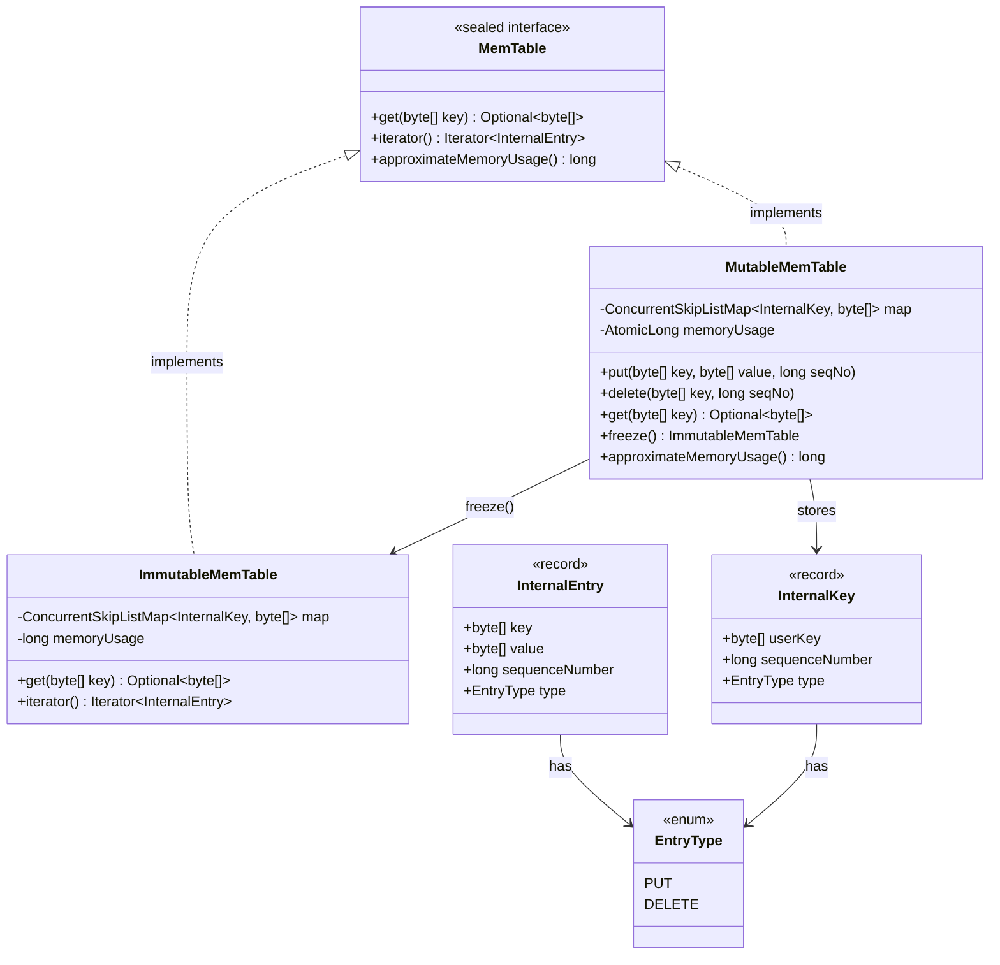
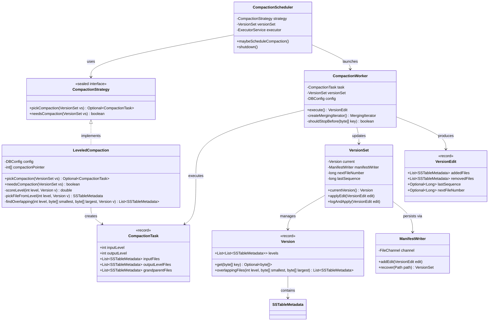

# C4 Level 4: Code Diagrams

Class-level diagrams for the three most critical subsystems.
These diagrams map directly to Java classes, interfaces, and records.

## 1. MemTable Subsystem



### Design Notes

- `MemTable` is a **sealed interface** — only `MutableMemTable` and `ImmutableMemTable` may implement it.
  This enables exhaustive pattern matching in `switch` expressions.
- `MutableMemTable` wraps `ConcurrentSkipListMap` for **lock-free reads** — readers never block writers.
- `InternalKey` encodes `(userKey, sequenceNumber, type)` and sorts by: userKey ascending, then
  sequenceNumber descending, then DELETE before PUT. This ensures the newest version of a key is found first.
- `freeze()` creates an `ImmutableMemTable` by transferring ownership of the underlying map (zero-copy).
- Memory usage is tracked approximately using `AtomicLong` — incremented on each put with
  `key.length + value.length + overhead`.

---

## 2. SSTable Subsystem

```mermaid
classDiagram
    class SSTableWriter {
        -FileChannel channel
        -BlockBuilder dataBlockBuilder
        -BlockBuilder indexBlockBuilder
        -BloomFilter bloomFilter
        -List~BlockHandle~ dataBlockHandles
        -long offset
        +add(byte[] key, byte[] value)
        +finish() SSTableMetadata
        -flushDataBlock()
        -writeFilterBlock() BlockHandle
        -writeIndexBlock() BlockHandle
        -writeFooter(BlockHandle metaIndex, BlockHandle index)
    }

    class SSTableReader {
        -FileChannel channel
        -Footer footer
        -IndexBlock indexBlock
        -BloomFilter bloomFilter
        -BlockCache blockCache
        -SSTableMetadata metadata
        +open(Path path, BlockCache cache) SSTableReader
        +get(byte[] key) Optional~byte[]~
        +iterator() SSTableIterator
        +close()
    }

    class SSTableMetadata {
        <<record>>
        +long fileNumber
        +int level
        +long fileSize
        +byte[] smallestKey
        +byte[] largestKey
        +long entryCount
    }

    class BlockBuilder {
        -ByteArrayOutputStream buffer
        -List~Integer~ restartOffsets
        -byte[] lastKey
        -int entryCount
        -int restartInterval
        +add(byte[] key, byte[] value)
        +finish() byte[]
        +estimatedSize() int
        +reset()
    }

    class BlockReader {
        -byte[] data
        -int restartOffset
        -int numRestarts
        +iterator() Iterator~InternalEntry~
        +seek(byte[] key) Optional~InternalEntry~
    }

    class BlockHandle {
        <<record>>
        +long offset
        +long size
    }

    class BlockCache {
        -ConcurrentHashMap~CacheKey, Block~ cache
        -long capacity
        -AtomicLong currentSize
        +get(long sstableId, long blockOffset) Optional~byte[]~
        +put(long sstableId, long blockOffset, byte[] block)
        +invalidate(long sstableId)
    }

    class BloomFilter {
        -byte[] bits
        -int numHashFunctions
        -int bitsPerKey
        +mightContain(byte[] key) boolean
        +add(byte[] key)
        +encode() byte[]
        +decode(byte[] data) BloomFilter$
    }

    class FilterPolicy {
        <<sealed interface>>
        +createFilter(List~byte[]~ keys) byte[]
        +mightContain(byte[] key, byte[] filter) boolean
    }

    class IndexBlock {
        -List~IndexEntry~ entries
        +lookup(byte[] key) Optional~BlockHandle~
    }

    class Footer {
        <<record>>
        +BlockHandle metaIndexHandle
        +BlockHandle indexHandle
        +long magicNumber
        +encode() byte[]
        +decode(byte[] data) Footer$
    }

    SSTableWriter --> BlockBuilder : uses
    SSTableWriter --> BloomFilter : builds
    SSTableWriter --> BlockHandle : produces
    SSTableWriter --> Footer : writes
    SSTableReader --> IndexBlock : holds
    SSTableReader --> BloomFilter : holds
    SSTableReader --> BlockCache : queries
    SSTableReader --> BlockReader : creates per block
    SSTableReader --> Footer : reads
    SSTableReader --> SSTableMetadata : describes
    IndexBlock --> BlockHandle : maps keys to
    FilterPolicy <|.. BloomFilter : implements
```



### SSTable File Layout

```
┌─────────────────────────────────┐
│         Data Block 0            │  ← sorted key-value entries with prefix compression
│         Data Block 1            │
│         ...                     │
│         Data Block N            │
├─────────────────────────────────┤
│         Filter Block            │  ← Bloom filter bits for all keys in the SSTable
├─────────────────────────────────┤
│       Meta-Index Block          │  ← maps "filter.bloom" → BlockHandle of Filter Block
├─────────────────────────────────┤
│         Index Block             │  ← maps last_key_of_block_i → BlockHandle of Data Block i
├─────────────────────────────────┤
│          Footer (48B)           │  ← meta-index handle, index handle, magic number
└─────────────────────────────────┘
```

### Data Block Entry Format

```
[shared_key_length: varint]       ← bytes shared with previous key (prefix compression)
[non_shared_key_length: varint]   ← bytes unique to this key
[value_length: varint]
[non_shared_key_bytes]
[value_bytes]
```

Restart points every 16 entries enable binary search within a block.

---

## 3. Compaction Subsystem



### Compaction Flow

```
CompactionScheduler.maybeScheduleCompaction()
  │
  ├── LeveledCompaction.needsCompaction(versionSet)
  │     └── Score each level: L0 = fileCount/4, Ln = totalSize / maxBytesForLevel(n)
  │     └── Return true if any score > 1.0
  │
  ├── LeveledCompaction.pickCompaction(versionSet)
  │     ├── Pick level with highest score
  │     ├── Pick file from that level (round-robin via compactionPointer)
  │     ├── Find overlapping files in level+1
  │     └── Return CompactionTask
  │
  └── CompactionWorker.execute(task)    ← runs on virtual thread
        ├── Open SSTableReaders for all input files
        ├── Create MergingIterator over all inputs
        ├── For each entry in merge order:
        │     ├── Skip if superseded (same key, lower seqNo)
        │     ├── Skip if tombstone below oldest snapshot + no deeper references
        │     └── Write to output SSTableWriter
        ├── Rotate output SSTable when it reaches target file size
        ├── Produce VersionEdit (remove inputs, add outputs)
        └── VersionSet.logAndApply(edit)  ← atomic
```

### Level Size Targets

| Level | Max Size | Max Files (approx at 2MB/file) |
|-------|----------|-------------------------------|
| L0    | N/A (triggered by file count > 4) | 4 |
| L1    | 10 MB | 5 |
| L2    | 100 MB | 50 |
| L3    | 1 GB | 500 |
| L4    | 10 GB | 5,000 |
| L5    | 100 GB | 50,000 |
| L6    | 1 TB | 500,000 |
