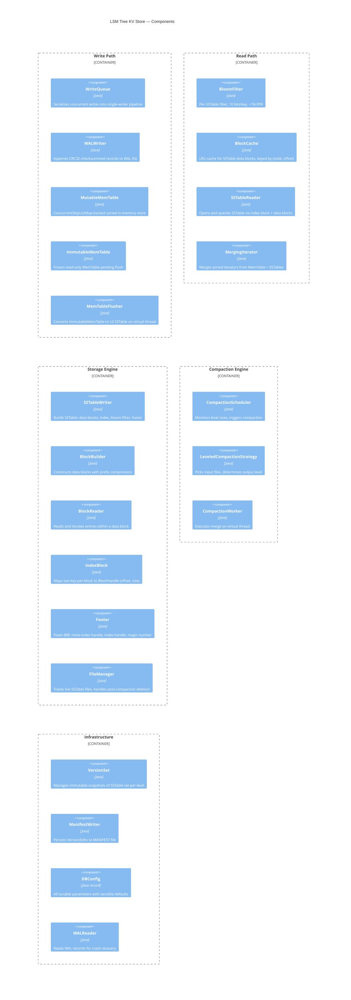

# C4 Level 3: Component Diagram

This diagram shows the internal components of the LSM Tree KV Store.
Each component maps directly to a Java class or small group of classes.

## Diagram



## Component Details

### Write Path Components

| Component | Class | Responsibility |
|-----------|-------|----------------|
| **WriteQueue** | `engine.WriteQueue` | Accepts `WriteBatch` from multiple threads, funnels into single-writer pipeline. Enables group commit (batch multiple fsync calls). |
| **WALWriter** | `wal.WALWriter` | Appends records to the WAL file. Record format: `[CRC32 4B][Length 2B][Type 1B][Data]`. Supports records spanning 32KB block boundaries (FULL/FIRST/MIDDLE/LAST types). |
| **MutableMemTable** | `memtable.MutableMemTable` | Wraps `ConcurrentSkipListMap<InternalKey, byte[]>`. Lock-free reads via CAS. Tracks approximate memory usage. Triggers freeze when size exceeds `maxMemTableSize`. |
| **ImmutableMemTable** | `memtable.ImmutableMemTable` | Read-only frozen snapshot of a MutableMemTable. Remains queryable during read path until the background flush completes. |
| **MemTableFlusher** | `engine.MemTableFlusher` | Iterates ImmutableMemTable in sorted order, writes entries to a new L0 SSTable via SSTableWriter, then updates VersionSet and deletes the old WAL. Runs on a virtual thread. |

### Read Path Components

| Component | Class | Responsibility |
|-----------|-------|----------------|
| **BloomFilter** | `sstable.filter.BloomFilter` | Per-SSTable Bloom filter. Built during SSTable creation (10 bits/key → ~1% FPR). Loaded into memory on SSTable open. Avoids unnecessary disk reads for absent keys. |
| **BlockCache** | `sstable.block.BlockCache` | LRU cache keyed by `(sstableId, blockOffset)`. Default 8MB. Shared across all SSTableReaders. Caches data blocks only (index blocks are small and held in-memory by each reader). |
| **SSTableReader** | `sstable.SSTableReader` | Opens an SSTable file. Reads the footer to locate index/meta blocks. For point lookups: binary search index → load data block (from cache or disk) → binary search within block. |
| **MergingIterator** | `iterator.MergingIterator` | Priority-queue-based merge of N sorted iterators (MemTable + SSTables). Used for range scans and compaction. Handles deduplication by preferring the newest version of each key. |

### Storage Engine Components

| Component | Class | Responsibility |
|-----------|-------|----------------|
| **SSTableWriter** | `sstable.SSTableWriter` | Accepts sorted key-value entries. Accumulates them in a BlockBuilder. When a block reaches `blockSize` (4KB), flushes it and records in the index. Finishes by writing the filter block, meta-index, index block, and footer. |
| **BlockBuilder** | `sstable.block.BlockBuilder` | Builds a single data block. Applies prefix compression with restart points every 16 keys. Entry format: `[shared_len varint][non_shared_len varint][value_len varint][non_shared_key][value]`. |
| **BlockReader** | `sstable.block.BlockReader` | Parses a data block. Supports iteration and binary search (via restart points) within the block. |
| **IndexBlock** | `sstable.IndexBlock` | Maps the last key of each data block to its `BlockHandle(offset, size)`. Enables O(log B) lookup where B = number of blocks. |
| **Footer** | `sstable.Footer` | Fixed 48 bytes at the end of every SSTable. Contains `BlockHandle` for the meta-index and index blocks, plus a magic number for format validation. |
| **FileManager** | `engine.FileManager` | Assigns file numbers, tracks which files are live (referenced by the current Version), and deletes obsolete files after compaction. |

### Compaction Engine Components

| Component | Class | Responsibility |
|-----------|-------|----------------|
| **CompactionScheduler** | `compaction.CompactionScheduler` | Periodically checks level sizes against thresholds. Triggers: L0 > 4 files, or Ln total size > 10^n × 10MB. Invoked after every flush and compaction. |
| **LeveledCompactionStrategy** | `compaction.LeveledCompaction` | Picks one file from the input level (round-robin to spread I/O). Finds all overlapping files in the output level. Creates a `CompactionTask`. |
| **CompactionWorker** | `compaction.CompactionWorker` | Executes the merge: creates a MergingIterator over inputs, writes output SSTables (rotating at target size), drops tombstones and superseded keys, atomically updates VersionSet. Runs on a virtual thread. |

### Infrastructure Components

| Component | Class | Responsibility |
|-----------|-------|----------------|
| **VersionSet** | `version.VersionSet` | Manages immutable `Version` snapshots. Each Version holds `List<List<SSTableMetadata>>` — the set of SSTables at each level. Versions are reference-counted so in-flight iterators/compactions don't see premature file deletions. |
| **ManifestWriter** | `version.ManifestWriter` | Appends `VersionEdit` records to the MANIFEST file. Each edit describes added/removed SSTables. On recovery, replaying all edits reconstructs the current Version. |
| **DBConfig** | `config.DBConfig` | Java record holding all tunable parameters with sensible defaults. Used by every component. |
| **WALReader** | `wal.WALReader` | Reads WAL records during crash recovery. Validates CRC32 checksums. Reassembles multi-record entries (FIRST+MIDDLE+LAST). |

## Key Interactions

```
[Client] → put() → [WriteQueue] → [WALWriter] → [MutableMemTable]
                                                        ↓ (full)
                                                [ImmutableMemTable]
                                                        ↓ (background)
[MemTableFlusher] → [SSTableWriter] → [BlockBuilder] → disk
                  → [VersionSet] + [ManifestWriter]

[Client] → get() → [MutableMemTable] → [ImmutableMemTable]
                  → [SSTableReader] → [BloomFilter] → [IndexBlock]
                  → [BlockCache] or disk → [BlockReader]

[CompactionScheduler] → [LeveledCompactionStrategy] → [CompactionWorker]
                      → [MergingIterator] → [SSTableWriter] → disk
                      → [VersionSet] + [ManifestWriter]
```
