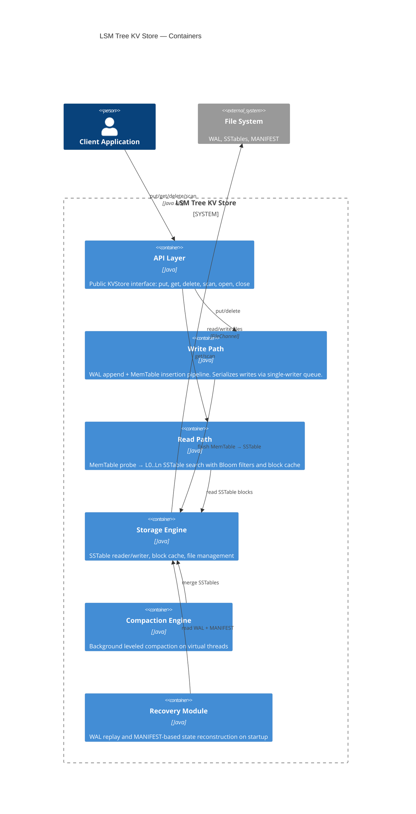

# C4 Level 2: Container Diagram

This diagram decomposes the LSM Tree KV Store into its major runtime containers.
Since this is an embedded library (not a distributed system), "containers" here represent
logical subsystems within the same JVM process.

## Diagram



## Container Descriptions

### API Layer (`com.lsmtreestore.api`)
Public-facing interface. Accepts `byte[]` keys and values. Provides:
- `put(key, value)` / `delete(key)` — routed to Write Path
- `get(key)` — routed to Read Path
- `scan(startKey, endKey)` — returns a `DBIterator` over the range
- `open(path, config)` / `close()` — lifecycle management

### Write Path (`com.lsmtreestore.engine`, `com.lsmtreestore.wal`, `com.lsmtreestore.memtable`)
1. **WriteQueue** — serializes concurrent write requests into a single-writer pipeline
2. **WALWriter** — appends CRC32-checksummed records to the write-ahead log
3. **MutableMemTable** — inserts key-value pairs into `ConcurrentSkipListMap`
4. **MemTableFlusher** — when MemTable is full, freezes it and schedules a background flush

### Read Path (`com.lsmtreestore.engine`, `com.lsmtreestore.memtable`, `com.lsmtreestore.sstable`)
1. Probe **MutableMemTable** (current writes)
2. Probe **ImmutableMemTable** (pending flush)
3. Search **Level 0** SSTables (newest first — files may overlap)
4. Search **Level 1..N** SSTables (one file per level via binary search on key ranges)
5. At each SSTable: **BloomFilter** → **IndexBlock** → **BlockCache**/disk read → **DataBlock**

### Storage Engine (`com.lsmtreestore.sstable`, `com.lsmtreestore.version`)
- **SSTableWriter** — builds SSTable files (data blocks, index, bloom filter, footer)
- **SSTableReader** — opens and queries SSTable files via index + block cache
- **BlockCache** — LRU cache for frequently accessed data blocks
- **VersionSet** — tracks which SSTables are live at each level
- **ManifestWriter** — persists version changes to the MANIFEST file

### Compaction Engine (`com.lsmtreestore.compaction`)
- **CompactionScheduler** — monitors level sizes, triggers compaction when thresholds are exceeded
- **LeveledCompactionStrategy** — picks input files and determines the output level
- **CompactionWorker** — merges input SSTables into output SSTables on virtual threads

### Recovery Module (`com.lsmtreestore.engine`)
On database open:
1. Reads **MANIFEST** to reconstruct the VersionSet
2. Replays **WAL** entries that were not yet flushed to SSTables
3. Rebuilds the MemTable from replayed entries

## Data Flow Summary

```
WRITE: Client → API → WriteQueue → WAL → MemTable → [flush] → SSTable (L0)
READ:  Client → API → MemTable → ImmMemTable → L0 → L1 → ... → Ln
COMPACTION: Scheduler → Strategy → Worker → merge SSTables → update VersionSet
RECOVERY: MANIFEST → VersionSet + WAL → MemTable replay
```
