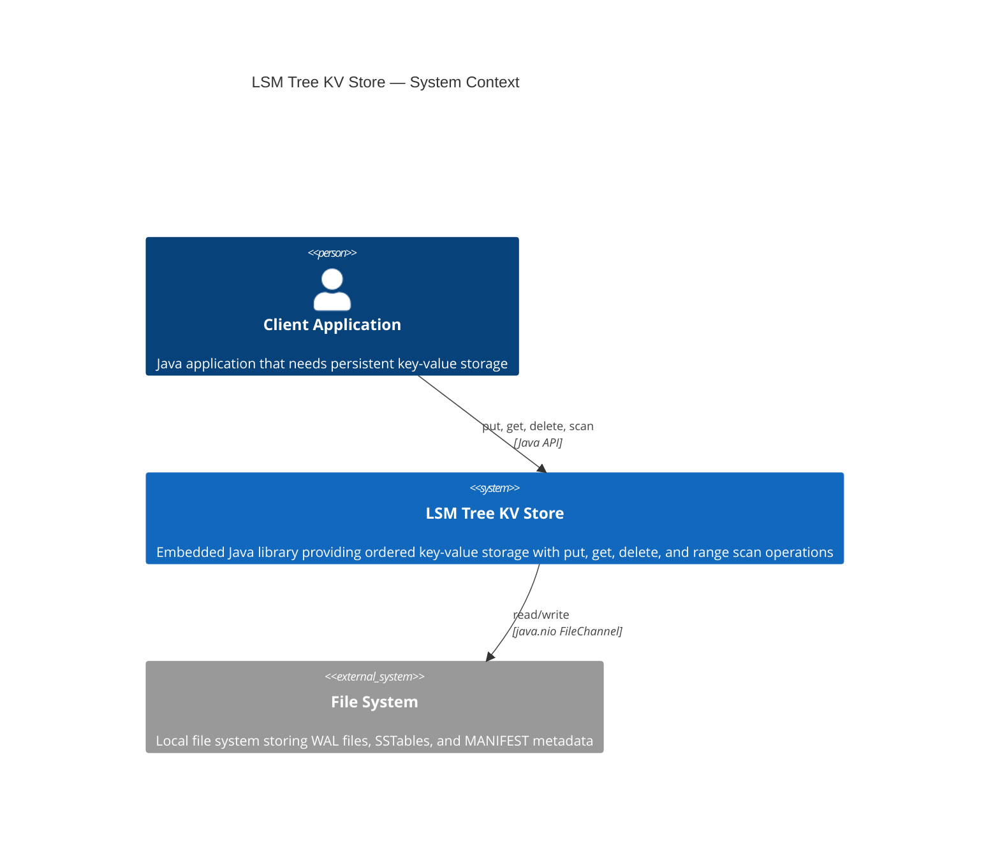

# C4 Level 1: System Context Diagram

This diagram shows the LSM Tree KV Store in the context of its external actors.
The store is an embedded library — it runs in the same JVM process as the client application
and persists data to the local file system.

## Diagram

## Actors

| Actor | Type | Description |
|-------|------|-------------|
| **Client Application** | Person/System | Any Java application embedding the KV Store. Interacts via the `KVStore` interface: `put(key, value)`, `get(key)`, `delete(key)`, `scan(start, end)`. |
| **LSM Tree KV Store** | System (this project) | The core storage engine. Manages MemTables, SSTables, WAL, compaction, and crash recovery. Runs entirely within the client's JVM process. |
| **File System** | External System | Local disk storage. Holds three categories of files: WAL logs (crash recovery), SSTables (persistent sorted data), and MANIFEST (metadata tracking which SSTables are live at each level). |

## Key Properties

- **Embedded** — no separate server process; the library is linked directly into the client application
- **Persistent** — all acknowledged writes survive process crashes (WAL guarantees durability)
- **Ordered** — keys are stored in sorted (lexicographic) order, enabling efficient range scans
- **Single-process** — only one process may open a given database directory at a time (enforced via file lock)
